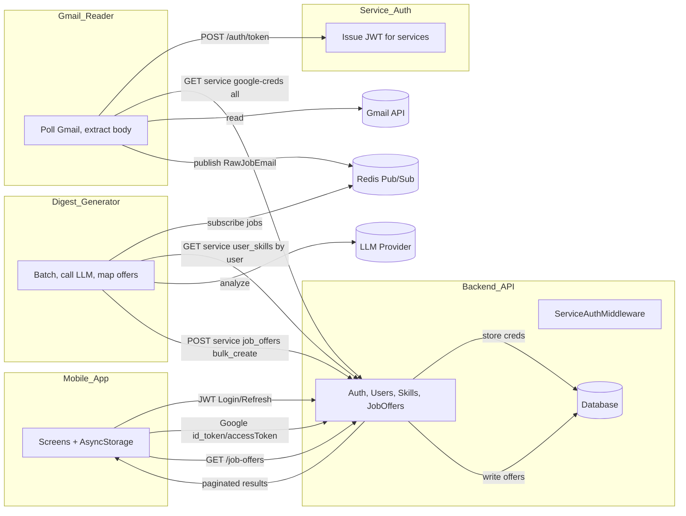
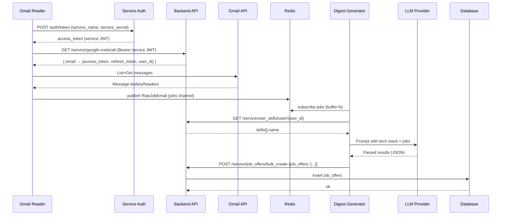
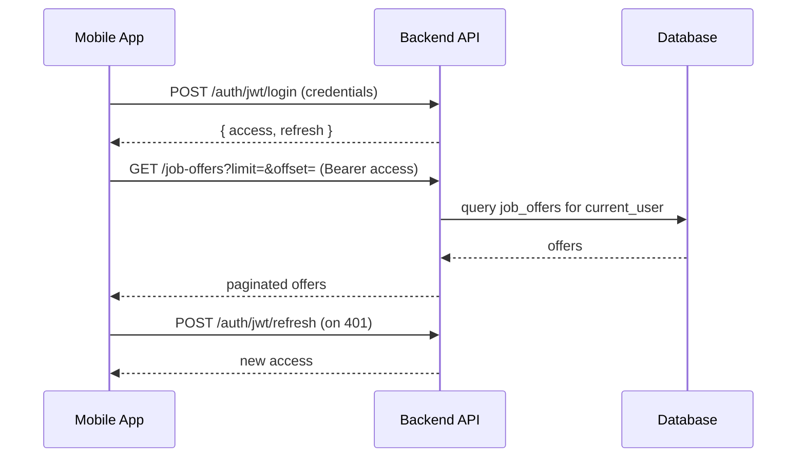

# NextJob AI — System Architecture

This document explains how the app works today, highlights gaps, and proposes a simple, modular architecture you can evolve independently.

## Overview

- Mobile app (React Native/Expo) for user login and viewing analyzed job offers.
- Backend API (FastAPI) for authentication, users, skills, Google OAuth, and job offers.
- Internal services:
  - Gmail Reader: polls Gmail for each user with stored Google credentials, publishes raw job emails.
  - Digest Generator: consumes raw emails, uses an LLM to extract/score, bulk-writes JobOffers.
- Messaging via Redis Pub/Sub for service-to-service events.
- Service-to-service auth via lightweight JWT microservice.

## Simplified architecture (v2-friendly)

- **Backend (single FastAPI app)** with domain modules: `auth/`, `users/`, `jobs/`, `skills/`, `integrations/`, and `rag/` (RAG endpoints are exposed under `/rag`).
- **Worker**: either a Celery worker in the same image or APScheduler/cron tasks invoked via the integrations helpers (e.g., Gmail reader, LinkedIn scraper).
- **Database**: PostgreSQL + `pgvector` (configured through the existing async SQLAlchemy engine).
- **Integrations**: service-scoped endpoints live under `/service/*` for Gmail credentials and bulk job ingestion, with helpers in `app/integrations/` to trigger the existing ingestion scripts.
- **Mobile app**: communicates only through the backend HTTP API; no direct coupling to workers.

## Current Data Flow

1. User auth (mobile → backend)

- Mobile calls `POST /auth/jwt/login` to get `access` and `refresh` tokens.
- Uses `GET /users/me` to keep session state.

2. Google OAuth link (mobile → backend)

- Mobile obtains Google `id_token` + `accessToken` (+ optional `refreshToken`).
- Mobile calls `POST /auth/google-login` with tokens.
- Backend validates Google token, creates/loads user, stores Google credentials in table `google_credentials`.

3. Ingestion (gmail_reader → backend → Gmail)

- Gmail Reader gets a service JWT from the backend service-auth helper (no standalone microservice directory).
- Calls backend `GET /service/google-creds/all` to fetch `{ email → {access_token, refresh_token, user_id} }`.
- Builds Gmail clients and scans recent messages, extracts plain/html body, filters by keywords.
- Publishes raw job email to Redis channel `jobs`:
  ```json
  {
    "email": "user@example.com",
    "subject": "…",
    "full_text": "…",
    "id": "<gmail_message_id>"
  }
  ```

4. Analysis (digest_generator → LLM → backend)

- Digest Generator subscribes to Redis `jobs` and batches N items (default 5).
- Builds a prompt with user tech stack and calls LLM (currently `g4f` client).
- Maps output to JobOffer fields and bulk-creates via backend.

5. Serving (mobile → backend)

- Mobile calls `GET /job-offers?limit=&offset=` (requires user JWT) to list analyzed offers.

## Gaps & Misalignments (Actionable)

- Gmail Reader credentials endpoint: uses `/google-creds/all` but backend exposes `/service/google-creds/all` (protected by service token).
- Digest Generator bulk-create endpoint: uses `POST /job_offers/bulk_create` but backend exposes `/service/job_offers/bulk_create`.
- Payload mismatch: Digest Generator posts `{ "jobs": [...] }` but backend expects `{ "job_offers": [...] }` matching `JobOfferCreate` fields.
- Tech stack endpoint: Digest Generator calls `/users/{id}/tech_stack` which doesn’t exist. Use `/service/user_skills/user/{id}` and map `skills[].name` → tech stack.
- Multi-tenancy: `GET /job-offers` doesn’t filter by `current_user`; should filter to return only the caller’s offers.
- Idempotency: Gmail Reader tracks processed IDs in a local file; move to DB (`gmail_ingest_log` with `gmail_message_id`, `user_id`, `created_at`) to avoid reprocessing and support scaling.
- Secrets/config: Service secrets should be provided via environment variables for the backend service-auth helper rather than hardcoded values.
- LLM client: `g4f` with `model="gpt-4"` is brittle; prefer official providers (OpenAI, Anthropic, etc.) via env-configured keys.

## Target Architecture (Modular Blocks)

1. Identity & Accounts (Backend)

- Auth via FastAPI Users (JWT access + refresh).
- Endpoints: `/auth/jwt/login`, `/auth/jwt/refresh`, `/users/*`.

2. User Profile & Skills (Backend)

- Entities: `Skill`, `UserSkill (m:n)`.
- Endpoints:
  - Public JWT: `/user_skills`, `/user_skills/user/{user_id}` (owner-only).
  - Service JWT: `/service/user_skills/user/{user_id}`.

3. Integrations: Google OAuth + Credentials (Backend)

- Endpoint: `POST /auth/google-login` stores `access_token` + `refresh_token` in `google_credentials`.
- Service endpoint: `GET /service/google-creds/all` (email → creds).
- Enhancement: store `token_expiry` and auto-refresh logic.

4. Ingestion Service (Gmail Reader)

- Pulls creds from `/service/google-creds/all` using service JWT.
- Polls Gmail, extracts plain text/HTML, builds canonical RawJobEmail event:
  ```json
  {
    "user_id": 123,
    "email": "user@example.com",
    "gmail_message_id": "…",
    "subject": "…",
    "full_text": "…",
    "received_at": "2025-12-10T12:34:56Z",
    "source": "gmail"
  }
  ```
- Publishes to Redis (`jobs`) or Redis Streams for durability.
- Writes `gmail_ingest_log` for idempotency (optional if using Streams + consumer groups).

5. Analysis Service (Digest Generator)

- Consumes RawJobEmail events in small batches.
- Fetches user stack via `/service/user_skills/user/{user_id}` → `skills[].name` list.
- Calls LLM provider (OpenAI/Anthropic) with timeout/retries.
- Produces normalized `AnalyzedJobOffer`:
  ```json
  {
    "user_id": 123,
    "email": "user@example.com",
    "match_score": 7,
    "reason": "…",
    "technologies_matched": "React, TypeScript",
    "title": "Frontend Engineer",
    "company": "Acme",
    "location": "Remote",
    "description": "(optional short summary)",
    "apply_link": "https://…",
    "source_id": "<gmail_message_id>",
    "source": "gmail"
  }
  ```
- Bulk writes via `POST /service/job_offers/bulk_create` with body `{ "job_offers": [ … ] }`.

6. Data API (Backend)

- `GET /job-offers` returns only offers for `current_user` (pagination).
- `DELETE /job-offers/{id}` deletes offer (owner-only).
- Service-only bulk create: `/service/job_offers/bulk_create`.

7. Mobile App

- Stores `access` + `refresh` in `AsyncStorage`.
- Uses `/auth/jwt/refresh` on 401.
- Screens: Login, Connect Google, Job Offers list/detail.

8. Cross-Cutting

- Service-to-service auth: dedicated microservice issues short-lived JWT with `scope="service"`; backend middleware protects `/service/*`.
- Observability: structured logs per component, correlation IDs from message to DB write.

## Minimal Changes to Align (Quick Wins)

- Gmail Reader
  - `CREDENTIAL_ENDPOINT`: `http://localhost:8000/service/google-creds/all`.
- Digest Generator
  - `API_URL`: `http://localhost:8000/service/job_offers/bulk_create`.
  - Use `json={"service_name": ..., "service_secret": ...}` when fetching service token (not form-encoded `data=`).
  - Change payload to `{ "job_offers": [...] }` and map fields exactly to `JobOfferCreate`.
  - Replace `/users/{id}/tech_stack` with `/service/user_skills/user/{id}`; map `skills[].name` → list.
- Backend
  - Filter `GET /job-offers` by `current_user.id` for multi-tenant safety.
  - Add `source` + `source_id` columns to `job_offers` for idempotency (optional, recommended).

## Env/Config (suggested)

- Backend: `SECRET_KEY`, `ACCESS_TOKEN_LIFETIME_MINUTES`, `ALLOWED_HOSTS`.
- Service Auth: `SERVICE_JWT_SECRET`, `SERVICE_JWT_ALG`, per-service secrets in env.
- Gmail Reader: `REDIS_HOST`, `BACKEND_BASE_URL`, `SERVICE_AUTH_URL`.
- Digest Generator: `REDIS_HOST`, `BACKEND_BASE_URL`, `SERVICE_AUTH_URL`, `LLM_PROVIDER`, `LLM_MODEL`, `OPENAI_API_KEY` (etc.).

## Execution Contracts (copy-paste ready)

- Service JWT

  - Request: `POST {SERVICE_AUTH_URL}/auth/token` body:
    ```json
    { "service_name": "gmail_service", "service_secret": "gmail_secret" }
    ```
  - Response: `{ "access_token": "…", "token_type": "bearer" }`.

- Get Google Credentials

  - `GET {BACKEND_BASE_URL}/service/google-creds/all` with header `Authorization: Bearer <service-jwt>`.

- Bulk Create Job Offers
  - `POST {BACKEND_BASE_URL}/service/job_offers/bulk_create`
  - Body:
    ```json
    {
      "job_offers": [
        {
          "user_id": 123,
          "email": "user@example.com",
          "match_score": 7,
          "reason": "…",
          "technologies_matched": "React, TypeScript",
          "title": "Frontend Engineer",
          "company": "Acme",
          "location": "Remote",
          "description": "(optional)",
          "apply_link": "https://…"
        }
      ]
    }
    ```

## Roadmap (phased)

- Phase 1: Align endpoints/payloads; filter job offers by user; move service secrets to env.
- Phase 2: Idempotency (DB log or Streams), add `source/source_id`, retry policies, better Gmail filtering.
- Phase 3: Swap to official LLM SDK; add unit tests for prompt → schema validation.
- Phase 4: Observability (structured logs, metrics), production deployment (Docker Compose), move DB to Postgres.

---

This keeps the design simple: clear blocks with thin, well-defined interfaces so each can evolve independently without over-engineering.

## Diagrams

### Component Architecture



### Sequence: Ingestion → Analysis → Storage



### Sequence: Mobile Login and View Offers


